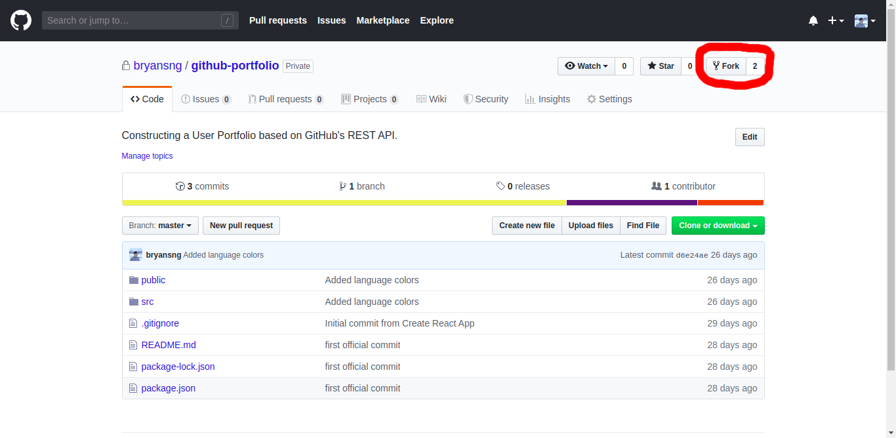
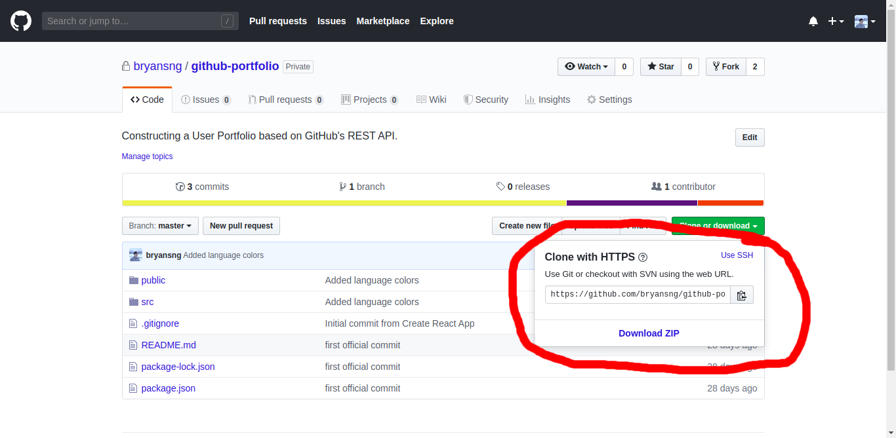
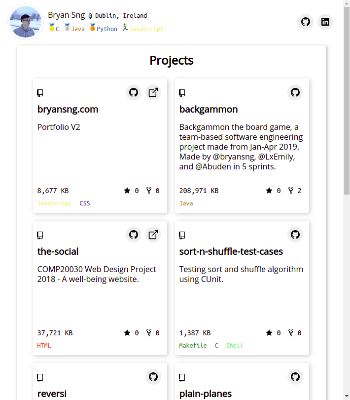
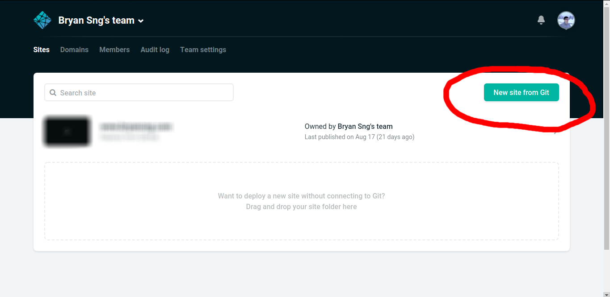
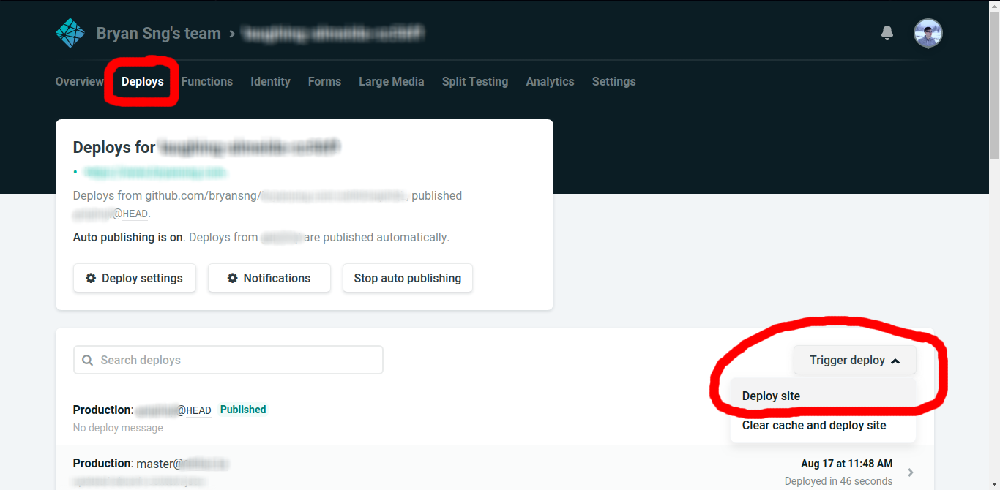

# Part 2 - JAM (React.js) <!-- omit in toc -->

## Workshop Goal <!-- omit in toc -->


<!-- TABLE OF CONTENTS -->
## Table of Contents <!-- omit in toc -->
- [Getting Started (< 20 minutes)](#getting-started--20-minutes)
	- [Prerequisites (< 10 minutes)](#prerequisites--10-minutes)
	- [Installation (< 10 minutes)](#installation--10-minutes)
		- [1. Fork the repo](#1-fork-the-repo)
		- [2. Open your terminal/command prompt.](#2-open-your-terminalcommand-prompt)
		- [3. Clone/Download the repository into a folder in your local computer](#3-clonedownload-the-repository-into-a-folder-in-your-local-computer)
		- [4. Navigate into the cloned repo and install NPM packages](#4-navigate-into-the-cloned-repo-and-install-npm-packages)
		- [5. Update git remote](#5-update-git-remote)
		- [6. Start a live local server.](#6-start-a-live-local-server)
		- [7. Connect to localhost:3000 using your browser.](#7-connect-to-localhost3000-using-your-browser)
- [Tasks (< 41 minutes)](#tasks--41-minutes)
	- [1. Updating GitHub username. (< 1 minutes)](#1-updating-github-username--1-minutes)
	- [2. Add in code to fetch data using REST APIs. (< 5 minutes)](#2-add-in-code-to-fetch-data-using-rest-apis--5-minutes)
	- [3. Complete the fetch call for language colors. (< 10 minutes)](#3-complete-the-fetch-call-for-language-colors--10-minutes)
	- [4. Reconstruct TopBar in src/components/LandingPage.js. (< 10 minutes)](#4-reconstruct-topbar-in-srccomponentslandingpagejs--10-minutes)
	- [5. Change all Logo Icon Background from Square to Circle. (< 5 minutes)](#5-change-all-logo-icon-background-from-square-to-circle--5-minutes)
	- [6. Deploying with Netlify. (< 10 minutes)](#6-deploying-with-netlify--10-minutes)

<br />

<!-- GETTING STARTED -->
## Getting Started (< 20 minutes)
### Prerequisites (< 10 minutes)

* [Install Git](https://git-scm.com/downloads)
* [Install LTS Node.js and npm](https://www.npmjs.com/get-npm)
  * Check if Node.js and npm is installed with
	```sh
	node -v
	npm -v
	```
* [Install create-react-app and create a new app called my-app](https://create-react-app.dev/docs/getting-started)
	```sh
	npx create-react-app my-app
	cd my-app
	npm start
	```

<br />

### Installation (< 10 minutes)
 
#### 1. Fork the repo

 
#### 2. Open your terminal/command prompt.

#### 3. Clone/Download the repository into a folder in your local computer
```sh
git clone https://github.com/your_username/forked-repo-name.git
```


#### 4. Navigate into the cloned repo and install NPM packages
```sh
npm install
```

#### 5. Update git remote
```sh
git remote set-url origin https://github.com/your_username/forked-repo-name.git
```

#### 6. Start a live local server.
```sh
npm start
```

#### 7. Connect to localhost:3000 using your browser.
- After npm start, it will show where your React app is hosted.
- Copy and paste the address into the search bar of your browser.

<br />

<!-- TASKS -->
## Tasks (< 41 minutes)

### 1. Updating GitHub username. (< 1 minutes)
<p>@src/config/content.json

1. Change the github_username key's value to your GitHub username.

NOTE:
- The website will update to whoever's GitHub portfolio it is.
- There will be **no immediate visible effect** until you finish the next task. (because we haven add in the code to fetch data from GitHub yet).
</p>
<br />


### 2. Add in code to fetch data using REST APIs. (< 5 minutes)
<p>
@src/components/LandingPage.js

Fetches user's profile
```javascript
fetch(`https://api.github.com/users/${content.github_username}`)
.then(response => response.json())
.then(result => {
	this.setState({ user: result });
	document.title = `${result.name}'s Portfolio`;
});
```

1. Scroll down to componentDidMount() of LandingPage class.
2. Copy and paste the code above into its designated spot.

<br />

@src/components/Projects.js

Fetches user's repositories
```javascript
fetch(`https://api.github.com/users/${github_username}/repos?${repo_endpoint_parameter}`)
.then(response => response.json())
.then(result => this.setState({ repos: result }));
```

1. Scroll down to componentDidMount() of Projects class.
2. Copy and paste the code above into its designated spot.
3. `git add .`
4. `git commit -m "added code to fetch from github api"`

<br />

NOTE:
- Visit `https://api.github.com/users/your_github_username`, this is the REST API endpoint provided by GitHub, this is actually what we are fetching. The response from the fetch call is that in string form. <br /><br /> That endpoint displays your GitHub user info.
<br /><br />
- Visit `https://api.github.com/users/your_github_username/repos`, this endpoint displays all your GitHub user repositories.
<br /><br />
- Doing this is to get you familiar with where all the API calls are, and what they look like.
- There are 3 API calls in total, one of which you will be completing in the next task.
</p>
<br />


### 3. Complete the fetch call for language colors. (< 10 minutes)
<p>@src/components/LandingPage.js

Language Colors URL
```html
https://raw.githubusercontent.com/Diastro/github-colors/master/github-colors.json
```

<br />

Things you will need to complete this task
1. [fetch](https://developer.mozilla.org/en-US/docs/Web/API/Fetch_API/Using_Fetch) method
2. Reference code
   ```javascript
	/* We specify an endpoint to fetch data from. */
	fetch('http://example.com/movies.json')
	/*
	Once fetched, we then parse the response.

	Response will be in the form of a string,
	we convert the data to json via .json() method.
	*/
	.then(function(response) {
		return response.json();
	})
	/*
	We can then do whatever we like with the json object.

	The example below converts the json back to a string and outputs to the console.
	*/
	.then(function(myJson) {
		console.log(JSON.stringify(myJson));
	});
	 ```

<br />

1. Scroll down to componentDidMount() of LandingPage class.
2. Write the code into its designated spot.
3. Once you fetch and parse the response as json, set the state of langColors to be the result of response.json(). i.e.
   ```javascript
	 this.setState({ langColors: result });
	 ```
4. `git add .`
5. `git commit -m "completed fetch call for language colors"`

<br />

NOTE:
- This is not actually a REST API endpoint, but a .json file served in raw format on the web by GitHub.
</p>
<br />


<!-- ### 3. Install, import tachyons .
Import Tachyons via CDN and change part of the code to be based on that. (Reason: Change only one because some might prefer separation of concerns. Changing only one gives them an idea of how powerful CDN can be, using other people’s work.)
<p>@...

1. ...

NOTE:
- ...
</p>
<br /> -->


### 4. Reconstruct TopBar in src/components/LandingPage.js. (< 10 minutes)
<p>@src/components/LandingPage.js


ImageContainer
```html
<ImageContainer>
	
</ImageContainer>
```

UserInfo
```html
<UserInfo>
	<span>{user.name}</span>
	<span className="f6 font-ubuntu-mono">&nbsp;@&nbsp;</span>
	<span className="f6 font-ubuntu-mono">{user.location}</span>
	{/* Something was here, determine based on the above image. */}
</UserInfo>
```
<!-- I am one of many, bound by a set of rules, I am either spoken or written, people know me well enough as means to communication, what am I? -->

Languages
```html
<Languages>
	{topLang.slice(0, number_of_languages_to_show).map((lang, ind) => (
		<Language key={ind} style={{color: `${langColors[lang[0]]}`}}>
			<Emoji src={emojis[ind]} />
			{lang[0]}
		</Language>
	))}
</Languages>
```

SocialMedia
```html
<SocialMedia>
	<GitHub urlToUse={`https://github.com/${github_username}`} />
	{user.blog.includes("linkedin.com") && <LinkedIn urlToUse={user.blog} />}
	{user.blog.includes("twitter.com") && <Twitter urlToUse={user.blog} />}
	{user.blog.includes("hackerrank.com") && <HackerRank urlToUse={user.blog} />}
</SocialMedia>
```

1. Scroll down to the render() method of the LandingPage component.
2. There you will find a commented section asking for help.
3. `git add .`
4. `git commit -m "reconstructed topBar"`

NOTE:
- You are only required to construct the TopBar with the codes given by referencing the template image.
- Components like TopBar, TopBarWrapper and User are already written for you, you can just use them (i.e. `<TopBar> some child components </TopBar>`).</p>
<br />


### 5. Change all Logo Icon Background from Square to Circle. (< 5 minutes)
<p>@src/components/SocialMedia/Logos.js



Currently, we use the Square component as the background for all Logo.

1. Go to the Logo component.
2. Within its return statement, change the Square component to the Circle component.
3. `git add .`
4. `git commit -m "changed logo background from square to circle"`

NOTE:
- The Circle component is already written for you.
- You only need to replace a word of code.</p>
<br />


### 6. Deploying with Netlify. (< 10 minutes)
<p>Netlify is an online service that provides continuous deployment through our online Git repositories (GitHub, GitLab, Bitbucket).

Upon git pushing our commits to our online repository, Netlify will be triggered to automatically build our React app, deploy it, and give you the URL to the deployed website.

1. Sign up @ https://www.netlify.com/
2. Click on New Site from Git button and follow the instructions to set it up. <br /> 
3. `git push -u master`
4. If you setup your Netlify to link to your GitHub repository you are pushing to, it should trigger Netlify to build and deploy based on the new pushed data.

NOTE:
* If all else fails, manually deploy:
  1. Click into your Netlify project.
	2. Click on the Deploys tab @top.
	3. Click on Trigger deploy @bottom right.
	4. Within the new dropdown, click on Deploy site.
  
</p>
<br />